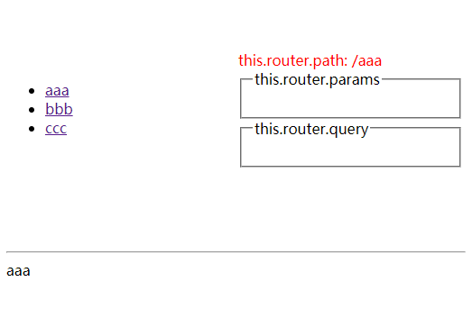
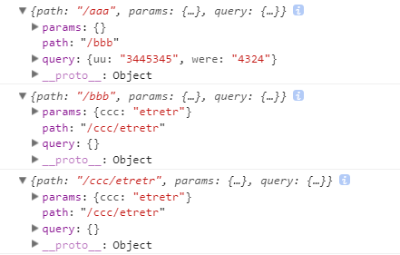

requirejs-avalon1.4.7-SPA-demo
---

### 关于demo项目
- 基于框架1.4.7模块的解耦合处理并解决了项目中存在的一些issue,只作为参考项目
- 未解耦参考项目：https://github.com/johnnynode/requirejs-avalon1.4.7-SPA-seed

### 项目克隆
- $`git clone git@github.com:johnnynode/requirejs-avalon1.4.7-SPA-demo.git --depth 1`

### 项目运行
- $`gulp server`

### 相关图片

    
  

### 解决的问题：
- 视图数据更新问题
- 路由参数更新问题

### 未解决的性能问题
- 多次快速点击链接切换路由，导致页面内存快速增加，等过一会儿会好转。

### 相关框架中提出的一些issue:
- https://github.com/RubyLouvre/mmRouter/issues/61 [html5的存在的问题,1]
- https://github.com/RubyLouvre/mmRouter/issues/55 [html5的存在的问题,2]
- https://github.com/RubyLouvre/mmRouter/issues/93 [作者回复：SPA应用不能刷新页面]
- https://github.com/RubyLouvre/mmRouter/issues/6 [f5 刷新问题]
- https://github.com/RubyLouvre/avalon/issues/1203 [数据不刷新问题]
